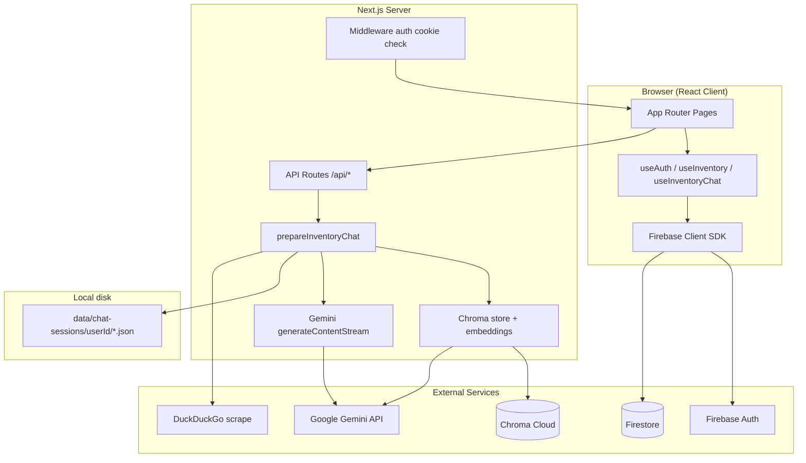

# Nexus AI — Inventory Management App

**Complete project documentation**

| Field | Value |
|-------|--------|
| **Project name** | `inventory-management-app` (branded as **Nexus AI**) |
| **Type** | Full-stack SaaS web application |
| **Primary language** | TypeScript |
| **Repository path** | `inventory-management-app/` |

---

## Table of contents

1. [Overview](#1-overview)
2. [Technology stack](#2-technology-stack)
3. [System architecture](#3-system-architecture)
4. [Project folder structure](#4-project-folder-structure)
5. [How the application works](#5-how-the-application-works)
6. [Authentication flow](#6-authentication-flow)
7. [Inventory management](#7-inventory-management)
8. [AI assistant & chatbot (RAG)](#8-ai-assistant--chatbot-rag)
9. [Analytics & AI insights](#9-analytics--ai-insights)
10. [API routes reference](#10-api-routes-reference)
11. [Functions & modules reference](#11-functions--modules-reference)
12. [Data models](#12-data-models)
13. [Environment variables](#13-environment-variables)
14. [Scripts & commands](#14-scripts--commands)
15. [UI & styling](#15-ui--styling)
16. [Security notes](#16-security-notes)
17. [Related projects](#17-related-projects)

---

## 1. Overview

Nexus AI is a **futuristic, dark-mode inventory management dashboard** with:

- User sign-up / login (Firebase Authentication)
- Real-time inventory CRUD stored in **Cloud Firestore**
- Dashboard metrics, analytics charts, and rule-based AI insights
- An **AI Assistant** powered by **Google Gemini**, integrated with:
  - Live inventory snapshots from Firestore
  - **ChromaDB Cloud** for RAG (retrieval-augmented generation)
  - Optional **web search** (DuckDuckGo + Gemini Google Search tool)
  - Document upload (PDF, DOCX, TXT) for supplier manuals and policies

The app was built with **Next.js 15 App Router** and connects to your standalone **gemini-rag-chatbot** stack (same Gemini + Chroma credentials).

---

## 2. Technology stack

### Core framework

| Technology | Version | Role |
|------------|---------|------|
| **Next.js** | 15.0.0 | React framework, App Router, API routes, SSR/CSR |
| **React** | 18.3.x | UI components |
| **TypeScript** | 5.x | Type-safe codebase |

### Backend & data

| Technology | Role |
|------------|------|
| **Firebase Auth** | Email/password authentication |
| **Cloud Firestore** | Per-user inventory documents |
| **Node.js file system** | Chat session history (`data/chat-sessions/`) |

### AI & search

| Technology | Role |
|------------|------|
| **@google/genai** | Gemini chat (streaming) + optional Google Search tool |
| **@langchain/google-genai** | Gemini embeddings for Chroma |
| **chromadb** | Vector database (Chroma Cloud) |
| **duck-duck-scrape** | Fallback web snippets for prompts |
| **mammoth** | DOCX text extraction |
| **pdf-parse** | PDF text extraction |
| **@langchain/textsplitters** | Chunking uploaded documents |

### UI & UX

| Technology | Role |
|------------|------|
| **Tailwind CSS** | Utility-first styling, glassmorphism theme |
| **Framer Motion** | Page and component animations |
| **Lucide React** | Icons |
| **react-hot-toast** | Notifications |
| **react-markdown** + **remark-gfm** | Render assistant replies |

---

## 3. System architecture



### Request flow (AI chat message)

1. User types in **AI Assistant** → `useInventoryChat.sendMessage()`.
2. Client sends `POST /api/chat` with `userId`, `sessionId`, `message`, `inventorySnapshot`, `useWebSearch`.
3. Server validates **auth cookie**, loads chat session from disk.
4. `prepareInventoryChat()`:
   - Syncs inventory items into **Chroma** (`syncInventoryToChroma`).
   - Runs **similarity search** on Chroma for the user’s query.
   - Optionally fetches **web snippets** (DuckDuckGo).
   - Builds a large **prompt** (inventory + RAG + history + web).
5. `generateContentStreamWithFallback()` streams Gemini response via **SSE**.
6. Messages saved to session JSON; client appends streamed text to UI.

---

## 4. Project folder structure

```
inventory-management-app/
├── app/                          # Next.js App Router
│   ├── layout.tsx                # Root layout, AuthProvider, Toaster
│   ├── page.tsx                  # Landing page
│   ├── login/                    # Login page
│   ├── signup/                   # Sign up page
│   ├── dashboard/                # Protected dashboard area
│   │   ├── layout.tsx            # Sidebar, Navbar, auth guard
│   │   ├── page.tsx              # Overview + stat cards
│   │   ├── inventory/            # Inventory table CRUD
│   │   ├── analytics/            # Charts
│   │   ├── ai-insights/          # Rule-based predictions
│   │   ├── ai-assistant/         # Gemini chat UI
│   │   └── settings/             # User settings
│   └── api/                      # Server API routes
│       ├── chat/route.ts         # Streaming AI chat
│       ├── session/route.ts      # Chat sessions CRUD
│       ├── history/route.ts      # Load session messages
│       ├── upload/route.ts       # Document → Chroma
│       └── import/route.ts       # Bulk Firestore import
├── components/                   # React UI components
│   ├── auth/                     # AuthForm
│   ├── chat/                     # InventoryChatPanel, ChatUploadButton
│   ├── dashboard/                # Table, modals, cards
│   ├── layout/                   # Sidebar, Navbar, MobileNav
│   ├── analytics/                # Charts
│   ├── ai/                       # AIInsightsPanel
│   ├── landing/                  # Landing navbar
│   ├── providers/                # AuthProvider
│   └── ui/                       # Button, Input, Modal, etc.
├── firebase/                     # Firebase client + data layer
│   ├── client.ts                 # initializeApp, auth, db
│   ├── auth.ts                   # signIn, signUp, logOut
│   └── inventory.ts              # Firestore CRUD + subscribe
├── hooks/
│   ├── useAuth.ts                # onAuthStateChanged
│   ├── useInventory.ts           # Real-time inventory + stats
│   └── useInventoryChat.ts       # Chat state + streaming
├── lib/
│   ├── chat/                     # Gemini, prompts, sessions, RAG prep
│   ├── chroma/                   # Chroma client, embeddings, store
│   ├── utils/                    # document-parser, chunker
│   ├── analytics.ts              # Chart data helpers
│   ├── ai-mock.ts                # Rule-based “AI” insights
│   └── constants.ts              # Categories, nav items
├── types/
│   ├── inventory.ts              # InventoryItem types
│   └── chat.ts                   # Chat, session, RAG types
├── utils/                        # format, status helpers
├── data/chat-sessions/           # Created at runtime (gitignored)
├── middleware.ts                 # Protect /dashboard and /api/*
├── .env.local                    # Secrets (not in git)
└── PROJECT_DOCUMENTATION.md      # This file
```

---

## 5. How the application works

### 5.1 Public area

| Route | Purpose |
|-------|---------|
| `/` | Marketing landing page with links to login/signup |
| `/login` | Email/password sign-in |
| `/signup` | Create account with display name |

### 5.2 Protected dashboard

After login, Firebase provides a `User` object. `dashboard/layout.tsx` redirects unauthenticated users to `/login`.

| Route | Purpose |
|-------|---------|
| `/dashboard` | Summary cards: total items, in/low/out of stock, mock AI prediction count |
| `/dashboard/inventory` | Full inventory table: add, edit, delete, seed samples |
| `/dashboard/analytics` | Stock movement, revenue simulation, category breakdown charts |
| `/dashboard/ai-insights` | Shortage predictions and restock suggestions (client-side rules) |
| `/dashboard/ai-assistant` | Full Gemini chat with RAG + uploads |
| `/dashboard/settings` | Profile-oriented settings UI |

### 5.3 Real-time data

Inventory uses Firestore **`onSnapshot`** listeners. When any document in `users/{userId}/inventory` changes, the UI updates without a manual refresh.

---

## 6. Authentication flow

### Components involved

- `firebase/client.ts` — Initializes Firebase with `NEXT_PUBLIC_*` env vars.
- `firebase/auth.ts` — `signUp`, `signIn`, `logOut`.
- `hooks/useAuth.ts` — Subscribes to `onAuthStateChanged`.
- `components/providers/AuthProvider.tsx` — Shares `user` and `loading` via React Context.
- `middleware.ts` — Checks `auth` cookie for `/dashboard` and chat APIs.

### Sign-in sequence

1. User submits `AuthForm` → `signIn(email, password)`.
2. Firebase returns credentials; app sets cookie: `auth=1` (7 days).
3. `useAuth` updates context; dashboard layout renders.
4. Middleware allows access when cookie is present.

### Firestore path convention

All inventory data is scoped per user:

```
users/{userId}/inventory/{itemId}
```

---

## 7. Inventory management

### Firestore functions (`firebase/inventory.ts`)

| Function | Description |
|----------|-------------|
| `subscribeInventory(userId, callback, onError?)` | Real-time listener; returns `Unsubscribe` |
| `addInventoryItem(userId, data)` | `addDoc` new item |
| `updateInventoryItem(userId, id, data)` | `updateDoc` partial fields |
| `deleteInventoryItem(userId, id)` | `deleteDoc` |
| `seedSampleInventory(userId, items)` | Bulk insert sample rows |

### Hook (`hooks/useInventory.ts`)

| Export | Description |
|--------|-------------|
| `items` | Current inventory array |
| `loading` | Initial load state |
| `error` | Firestore error message |
| `stats` | `{ total, inStock, lowStock, outOfStock, totalQty }` |

### UI components

- **`InventoryTable`** — Lists items, edit/delete actions.
- **`AddItemModal`** — Form for create/update (name, quantity, category, status).
- **`SeedSampleButton`** — Loads demo items from `lib/sample-items.ts`.

### Item fields

| Field | Type | Notes |
|-------|------|-------|
| `itemName` | string | Product name |
| `quantity` | number | Stock count |
| `category` | string | e.g. Electronics, Office |
| `status` | `in_stock` \| `low_stock` \| `out_of_stock` | Normalized via `utils/status.ts` |
| `createdAt` | ISO string | Set on create |

---

## 8. AI assistant & chatbot (RAG)

Linked to **gemini-rag-chatbot** / **CHATBOT10**: same Gemini API key and Chroma Cloud database (separate collection: `inventory_assistant_v1`).

### 8.1 Client layer

| File | Role |
|------|------|
| `components/chat/InventoryChatPanel.tsx` | Chat UI, markdown replies, web toggle, upload |
| `hooks/useInventoryChat.ts` | Sessions, streaming parse, `uploadDocument` |
| `components/chat/ChatUploadButton.tsx` | File picker (PDF/DOCX/TXT) |

### 8.2 Server pipeline

| Step | Module | Function |
|------|--------|----------|
| 1 | `lib/chat/sync-inventory-chroma.ts` | `syncInventoryToChroma` — upsert items into Chroma |
| 2 | `lib/chroma/store.ts` | `searchSimilarChunks` — vector search filtered by `userId` |
| 3 | `lib/chat/web-search.ts` | `shouldUseWebSearch`, `searchWebFallback` |
| 4 | `lib/chat/prompt.ts` | `buildInventoryChatPrompt` — combines all context |
| 5 | `lib/chat/gemini-generate.ts` | `generateContentStreamWithFallback` — stream from Gemini |
| 6 | `lib/chat/prepare-chat.ts` | `prepareInventoryChat`, `saveChatMessages` |
| 7 | `lib/chat/session-manager.ts` | File-based session storage |

### 8.3 Chroma metadata

Each vector chunk stores:

- `userId` — isolates data per account
- `source` — `"inventory"` or `"upload"`
- `filename`, `fileType`, `itemId`, `chunkIndex`, etc.

### 8.4 Document upload

1. User attaches file → `POST /api/upload` (multipart).
2. `parseDocument` → `chunkText` → `storeDocumentChunks`.
3. Chunks embedded with **Gemini embedding model** and stored in Chroma.
4. Future chat queries retrieve relevant upload snippets via RAG.

### 8.5 Chat session storage

Sessions live on disk:

```
data/chat-sessions/{userId}/{sessionId}.json
```

Each file contains `title`, `messages[]`, timestamps. Not stored in Firestore.

---

## 9. Analytics & AI insights

### Analytics (`lib/analytics.ts`) — deterministic, not LLM

| Function | Output |
|----------|--------|
| `calcStockMovement(items)` | 7-day simulated stock series + counts |
| `calcRevenueSimulation(items)` | Weekly revenue estimate from quantity × category boost |
| `categoryBreakdown(items)` | Top categories by total quantity |

Used by `components/analytics/AnalyticsChart.tsx` on `/dashboard/analytics`.

### AI insights (`lib/ai-mock.ts`) — rule-based heuristics

| Function | Logic |
|----------|--------|
| `predictShortages(items)` | Items with `quantity <= 8`, estimated days until stockout |
| `restockSuggestions(items)` | Low/out-of-stock items with suggested reorder qty |
| `inventoryHealthScore(items)` | 0–100 score from status penalties |
| `aiPredictionCount(items)` | Count of shortage predictions for dashboard card |

Displayed on `/dashboard/ai-insights` via `AIInsightsPanel`.

> **Note:** These insights are **not** powered by Gemini; they use simple thresholds. The **AI Assistant** page uses real Gemini + RAG.

---

## 10. API routes reference

| Method | Route | Auth | Description |
|--------|-------|------|-------------|
| `POST` | `/api/chat` | Cookie | Stream Gemini reply (SSE) |
| `GET` | `/api/session?userId=` | Cookie | List chat sessions |
| `POST` | `/api/session` | Cookie | Create session `{ userId, title? }` |
| `DELETE` | `/api/session?userId=&id=` | Cookie | Delete session |
| `GET` | `/api/history?userId=&sessionId=` | Cookie | Get messages for session |
| `POST` | `/api/upload` | Cookie | Upload file → Chroma (`file`, `userId`, `sessionId`) |
| `POST` | `/api/import` | Server | Bulk import JSON to Firestore (admin/script use) |

### `/api/chat` request body

```json
{
  "sessionId": "uuid",
  "userId": "firebase-uid",
  "message": "Which items need restocking?",
  "useWebSearch": true,
  "inventorySnapshot": [
    {
      "id": "doc-id",
      "itemName": "Widget",
      "quantity": 3,
      "category": "Electronics",
      "status": "low_stock"
    }
  ]
}
```

### SSE response events

| Event | Meaning |
|-------|---------|
| `{ "status": "searching_web" }` | Web search phase started |
| `{ "text": "..." }` | Partial assistant text |
| `[DONE]` | Stream complete |
| `{ "error": "..." }` | Failure message |

---

## 11. Functions & modules reference

### Firebase (`firebase/`)

| Function | File |
|----------|------|
| `getGeminiClient()` | `lib/chat/gemini.ts` |
| `signUp`, `signIn`, `logOut` | `firebase/auth.ts` |
| `subscribeInventory`, `addInventoryItem`, `updateInventoryItem`, `deleteInventoryItem`, `seedSampleInventory` | `firebase/inventory.ts` |
| `assertFirebaseConfig()` | `firebase/client.ts` |

### Chat / Gemini (`lib/chat/`)

| Function | Purpose |
|----------|---------|
| `prepareInventoryChat` | Full RAG + prompt assembly |
| `saveChatMessages` | Persist user/assistant turns |
| `buildInventoryChatPrompt` | Format system + context prompt |
| `formatInventoryForPrompt` | Summarize items for LLM |
| `toSnapshot` | `InventoryItem[]` → chat payload |
| `generateContentStreamWithFallback` | Try models on rate limit |
| `formatGeminiError` | User-friendly API errors |
| `createSession`, `getSession`, `listSessions`, `addMessage`, `getConversationHistory`, `deleteSession` | Session file CRUD |
| `requireAuthCookie` | API auth guard |

### Chroma (`lib/chroma/`)

| Function | Purpose |
|----------|---------|
| `isChromaConfigured` | Check env vars present |
| `getCollection` | Chroma Cloud collection handle |
| `generateEmbeddings`, `generateQueryEmbedding` | Gemini embeddings |
| `storeDocumentChunks` | Save upload chunks |
| `upsertInventoryChunks` | Replace user’s inventory vectors |
| `searchSimilarChunks` | RAG retrieval |
| `getUserDocuments` | List uploaded filenames |

### Utilities

| Function | File |
|----------|------|
| `normalizeStatus` | `utils/status.ts` |
| `chunkText` | `lib/utils/chunker.ts` |
| `parseDocument`, `validateFile` | `lib/utils/document-parser.ts` |

---

## 12. Data models

### `InventoryItem` (`types/inventory.ts`)

```typescript
interface InventoryItem {
  id: string;
  userId: string;
  itemName: string;
  quantity: number;
  category: string;
  status: "in_stock" | "low_stock" | "out_of_stock" | string;
  createdAt: string;
}
```

### `ChatMessage` / `SessionData` (`types/chat.ts`)

```typescript
interface ChatMessage {
  id: string;
  role: "user" | "assistant" | "system";
  content: string;
  timestamp: string;
}

interface SessionData {
  id: string;
  title: string;
  createdAt: string;
  updatedAt: string;
  messageCount: number;
  messages: ChatMessage[];
}
```

### `RetrievedChunk` (RAG)

```typescript
interface RetrievedChunk {
  content: string;
  metadata: ChromaChunkMetadata;
  score: number; // similarity 0–1
}
```

---

## 13. Environment variables

Copy `.env.local.example` → `.env.local`.

### Firebase (required for auth & inventory)

| Variable | Description |
|----------|-------------|
| `NEXT_PUBLIC_FIREBASE_API_KEY` | Web API key |
| `NEXT_PUBLIC_FIREBASE_AUTH_DOMAIN` | `*.firebaseapp.com` |
| `NEXT_PUBLIC_FIREBASE_PROJECT_ID` | Firebase project ID |
| `NEXT_PUBLIC_FIREBASE_STORAGE_BUCKET` | Storage bucket |
| `NEXT_PUBLIC_FIREBASE_MESSAGING_SENDER_ID` | Sender ID |
| `NEXT_PUBLIC_FIREBASE_APP_ID` | App ID |
| `NEXT_PUBLIC_FIREBASE_MEASUREMENT_ID` | Optional Analytics |

### Gemini (required for AI Assistant)

| Variable | Description |
|----------|-------------|
| `GEMINI_API_KEY` | Google AI / Gemini API key |
| `GEMINI_MODEL` | Default: `gemini-2.5-flash` |
| `GEMINI_FALLBACK_MODELS` | Comma-separated fallback models |
| `GEMINI_MAX_OUTPUT_TOKENS` | Default: `2048` |
| `GEMINI_EMBEDDING_MODEL` | Default: `gemini-embedding-001` |
| `WEB_SEARCH_ENABLED` | `true` / `false` |

### Chroma Cloud (required for RAG & uploads)

| Variable | Description |
|----------|-------------|
| `CHROMA_API_KEY` | Chroma Cloud API key |
| `CHROMA_TENANT` | Tenant UUID |
| `CHROMA_DATABASE` | Database name (e.g. `CHATBOT`) |
| `CHROMA_COLLECTION_NAME` | Default: `inventory_assistant_v1` |

> **Important:** After changing `.env.local`, restart `npm run dev`. Next.js inlines `NEXT_PUBLIC_*` at build/start time.

---

## 14. Scripts & commands

| Command | Description |
|---------|-------------|
| `npm run dev` | Start dev server on **http://localhost:3000** |
| `npm run dev:clean` | Delete `.next` cache, then start dev |
| `npm run build` | Production build |
| `npm run start` | Run production server |
| `npm run lint` | ESLint |
| `npm run seed` | Seed 30 items via `scripts/seed-30-items.mjs` |

### Firebase Console setup

1. Create project (e.g. `inventory-management-app-f1545`).
2. Enable **Authentication → Email/Password**.
3. Create **Firestore** database.
4. Register a **Web app** and copy config into `.env.local`.
5. Set Firestore security rules so users can only read/write their own `users/{uid}/inventory` paths.

---

## 15. UI & styling

- **Theme:** Dark mode default (`className="dark"` on `<html>`).
- **Effects:** Glassmorphism (`.glass`), neon gradients (`.text-gradient`, `.glow-border`), mesh background (`.mesh-bg`).
- **Config:** `tailwind.config.ts` — custom colors (`bg-deep`, `accent-cyan`, `accent-purple`).
- **Global CSS:** `app/globals.css` — base styles and utility classes.
- **Motion:** Framer Motion on cards, sidebar, chat messages.

---

## 16. Security notes

- Never commit `.env.local` or API keys to git.
- `middleware.ts` only checks an **`auth` cookie**, not a Firebase ID token on the server. For production, consider verifying Firebase session cookies on API routes.
- Chat sessions on disk are per-machine; use a database or cloud storage for multi-instance deployments.
- Configure **Firestore security rules** to enforce `request.auth.uid == userId`.

---

## 17. Related projects

| Project | Path | Relationship |
|---------|------|----------------|
| **gemini-rag-chatbot** | `Projects/gemini-rag-chatbot` | Standalone RAG chatbot; source of Chroma/Gemini patterns |
| **CHATBOT10** | `Projects/CHATBOT10` | Env template for Gemini + Chroma credentials |
| **OneDrive copy** | `OneDrive/Documents/New folder/inventory-management-app/` | Earlier copy with Firebase config |

---

## Quick reference: “What runs where?”

| Feature | Runs in browser | Runs on Next.js server |
|---------|-----------------|-------------------------|
| Login / signup | ✅ Firebase Auth | — |
| Inventory CRUD | ✅ Firestore SDK | — |
| Dashboard stats | ✅ `useInventory` | — |
| AI Insights rules | ✅ `lib/ai-mock.ts` | — |
| Analytics charts | ✅ `lib/analytics.ts` | — |
| Gemini chat stream | Receives SSE | ✅ `/api/chat` |
| Chroma RAG | — | ✅ embeddings + query |
| Document parse/upload | Sends file | ✅ `/api/upload` |
| Chat history files | — | ✅ `data/chat-sessions/` |

---

*Document generated for the Nexus AI inventory management application. Update this file when adding new routes, APIs, or integrations.*
